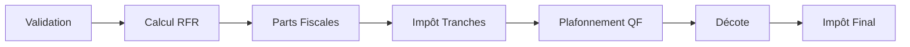

# 📊 Calculateur d'Impôt sur le Revenu (2024)

## 📌 Description
Un simulateur fiscal modulaire pour calculer l'impôt selon les règles françaises 2024. Prend en compte:
- Situations familiales (célibataire, marié, etc.)
- Enfants à charge et handicapés
- Parent isolé
- Abattements, décotes et plafonnements

## 🏗 Structure du Projet

```bash
com/kerware/simulateur/
├── model/               # Modèles de données
│   ├── SituationFamiliale.java  # Enum des statuts familiaux
│   └── FoyerFiscal.java         # Détails du foyer fiscal
├── services/            # Services métier
│   ├── AbattementService.java     # Calcul de l'abattement
│   ├── DecoteService.java         # Calcul de la décote
│   ├── PartsFiscalesService.java  # Gestion des parts fiscales
│   ├── PlafonnementService.java   # Plafonnement QF
│   ├── TrancheImpotService.java   # Barème progressif
│   └── ValidationService.java     # Validation des entrées
├── exceptions/          # Gestion des erreurs
│   └── CalculImpotException.java  # Exceptions métier
└── CalculateurImpot.java          # Coordinateur principal
```

### Légende
- 📁 **model** : Contient les objets métier
- ⚙️ **services** : Implémentation des règles fiscales
- 🚨 **exceptions** : Gestion des erreurs spécifiques
- 🧠 **CalculateurImpot** : Orchestre tous les services

### Bonnes Pratiques
- Séparation claire des responsabilités
- Nommage explicite des fichiers/classe
- Architecture modulaire et extensible

## ❔ Explication du Code

### 🏗 Architecture Modulaire
Le code est structuré en 3 couches principales :

1. **Modèle (model/)**
   - `SituationFamiliale.java` : Enumération des statuts familiaux avec leur nombre de parts
   - `FoyerFiscal.java` : Conteneur des données du contribuable (revenus, enfants, etc.)

2. **Services (services/)**  
   Chaque service gère une règle fiscale spécifique :
   ```java
   // Exemple : AbattementService.java
   public int calculer(int revenusNet) {
       double abattement = revenusNet * TAUX_ABATTEMENT;
       return (int) Math.round(Math.min(Math.max(abattement, MIN), MAX));
   }

3. **Orchestration (CalculateurImpot.java)**  
    Coordonne les services dans l'ordre fiscal :



